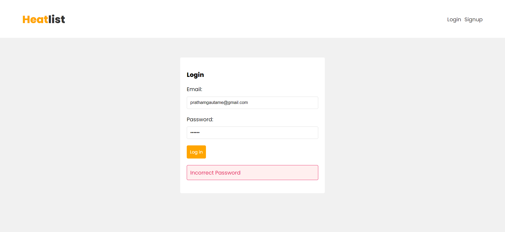
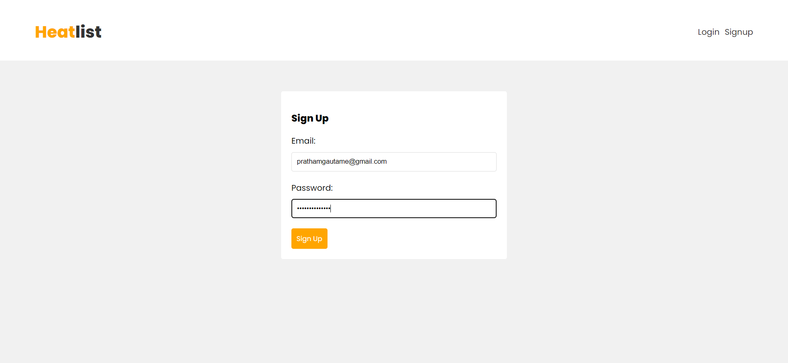
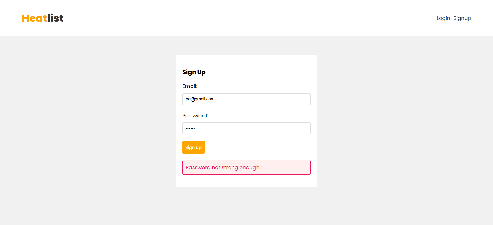
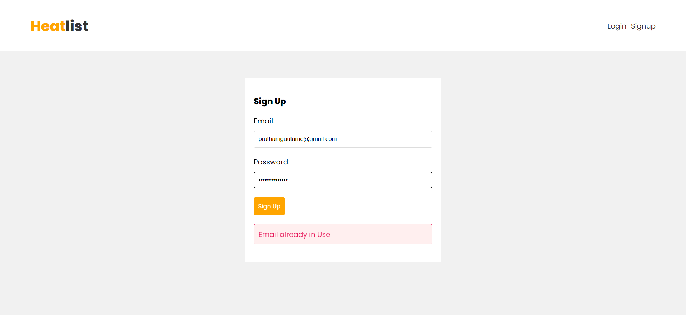
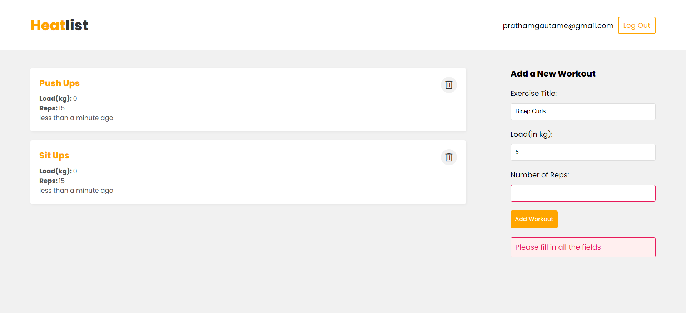
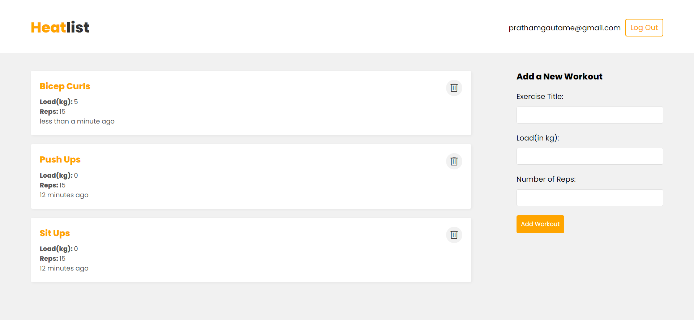

# HeatList

HeatList is a Workout Listing app built using React, NodeJS, ExpressJS, MongoDB and JWT Authentication.

## Table of Contents

- [Features](#features)
- [Screenshots](#screenshots)

## Features

- Add Workouts.
- Delete Workouts.
- Signup and Login.
- Responsive Design.

## Screenshots

- Login (with password validation)
    
  
- Sign Up
    
  
- Sign Up (with password strength validation)
    
  
- Sign Up (with email validation)
    
  
- Home (with form validation)
    
  
- Home (after adding workout)
    

